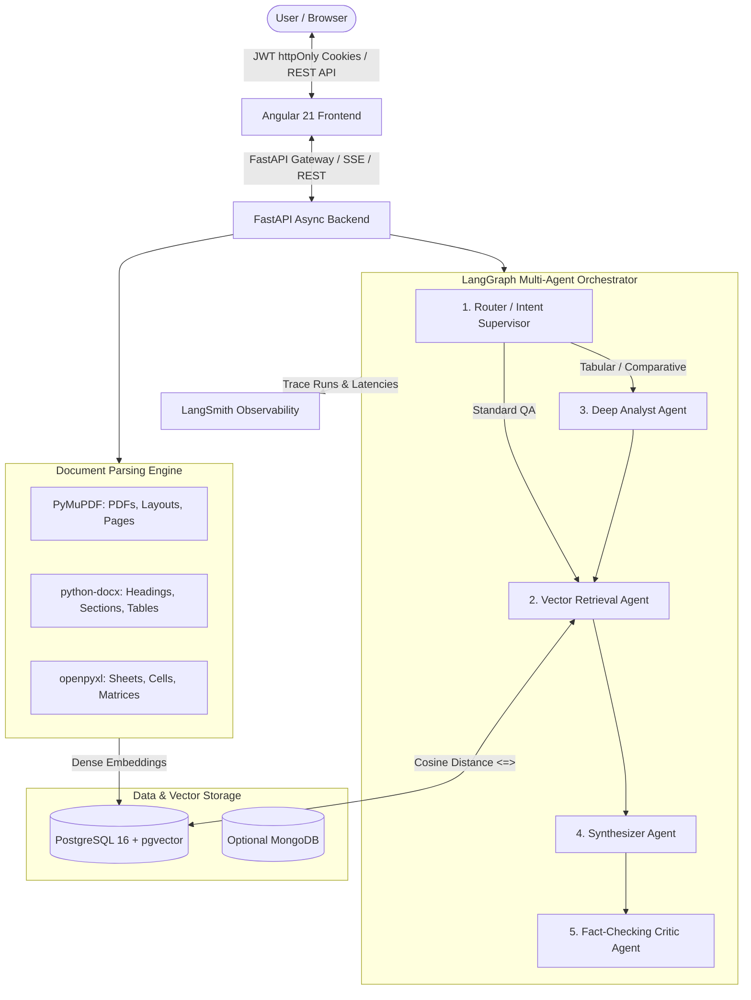

# AetherDoc: Multi-Agent Document Intelligence Platform

An enterprise-grade, autonomous Multi-Agent Document Intelligence Platform engineered with **FastAPI**, **LangGraph**, **Angular**, **PostgreSQL + pgvector**, **PyMuPDF**, **python-docx**, **openpyxl**, and **LangSmith** observability.

---

## Architecture Overview



---

## 🛠️ Complete Tech Stack

| Layer | Technology | Details |
|---|---|---|
| **Frontend** | [Angular](https://angular.dev/) (v21) | Standalone Components, Signals, Dark Glassmorphism, Reactive Forms, Citations Inspector |
| **Backend** | [FastAPI](https://fastapi.tiangolo.com/) | Async 3.11+, SQLAlchemy 2.0 Async, Pydantic v2, Uvicorn |
| **Agent Framework** | [LangGraph](https://www.langchain.com/langgraph) | Cyclic StateGraph, Supervisor Router, Specialized Worker Nodes |
| **LLM & Embeddings**| **Free-Source** (Groq / Ollama / FastEmbed) or OpenAI | 100% Free: Groq Llama 3.3 70B, Ollama local, FastEmbed CPU embeddings |
| **Document Processing**| `PyMuPDF`, `python-docx`, `openpyxl` | Deep structure extraction for PDFs, DOCX, and multi-sheet Excel |
| **Vector DB** | [PostgreSQL + pgvector](https://github.com/pgvector/pgvector) | Native high-dimensional vector index with cosine similarity (`<=>`) |
| **Database** | PostgreSQL / MongoDB | Unified PostgreSQL for metadata & vectors (optional MongoDB profile) |
| **Observability** | [LangSmith](https://smith.langchain.com/) | Real-time token tracing, step visualization, run metadata, feedback |
| **Authentication** | JWT + `httpOnly` Cookies | Secure cookie handling, Bearer header fallback, bcrypt password hashing |

---

## 🚀 Quick Start Guide

### Option 1: Docker Compose (All-in-One Deployment)

Prerequisites: [Docker & Docker Compose](https://docs.docker.com/compose/)

1. Clone and navigate to the project directory:
   ```bash
   cd Ai-Agent
   ```

2. Configure environment variables:
   ```bash
   cp backend/.env.example backend/.env
   # Add your OPENAI_API_KEY and LANGCHAIN_API_KEY inside backend/.env
   ```

3. Launch the platform:
   ```bash
   docker-compose up --build
   ```

4. Access the services:
   - **Frontend Application**: `http://localhost:4200`
   - **Backend API & Swagger Docs**: `http://localhost:8000/api/v1/docs`
   - **PostgreSQL + pgvector**: `localhost:5432`

---

## 🆓 Free-Source (Zero Cost) Options

You **do not** need a paid OpenAI API key to run this platform. The platform is pre-configured with free-source alternatives:

### 1. Free Embeddings: `FastEmbed` (Default)
- **100% Free & Runs Locally on CPU**: Uses ONNX runtime with `BAAI/bge-small-en-v1.5` (384 dimensions).
- Zero external API calls, zero cost, completely private.

### 2. Free LLM Option A: Groq Cloud (Recommended for Speed)
- Provides **ultra-fast LLaMA 3.3 70B & LLaMA 3.1 8B** at 500+ tokens/second.
- **100% Free Tier** with no credit card required.
- Get a free key at [console.groq.com](https://console.groq.com) and add it to `backend/.env`:
  ```env
  LLM_PROVIDER=groq
  GROQ_API_KEY=gsk_your_free_groq_key
  GROQ_MODEL=llama-3.3-70b-versatile
  ```

### 3. Free LLM Option B: Local Ollama (100% Offline)
- Run entirely offline on your computer using [Ollama](https://ollama.com/):
  ```bash
  ollama run llama3.2
  ```
- In `backend/.env`:
  ```env
  LLM_PROVIDER=ollama
  OLLAMA_MODEL=llama3.2
  OLLAMA_BASE_URL=http://localhost:11434
  ```

---

### Option 2: Local Development Setup

#### 1. Start PostgreSQL with pgvector
```bash
docker run -d --name pgvector -p 5432:5432 -e POSTGRES_PASSWORD=postgres -e POSTGRES_DB=doc_intelligence pgvector/pgvector:pg16
```

#### 2. Run the FastAPI Backend
```bash
cd backend

# Activate virtual environment
.\.venv\Scripts\activate   # On Windows
# source .venv/bin/activate  # On Linux/macOS

# Run development server
uvicorn app.main:app --reload --port 8000
```
API Documentation will be live at: [http://localhost:8000/api/v1/docs](http://localhost:8000/api/v1/docs)

#### 3. Run the Angular Frontend
```bash
cd frontend
npm start
```
Frontend Web App will be live at: [http://localhost:4200](http://localhost:4200)

---

## 🤖 Multi-Agent Workflow Details

The platform coordinates 5 specialized agents structured as a LangGraph `StateGraph`:

1. **Router / Intent Supervisor Agent**:
   - Classifies query complexity into `simple_qa`, `deep_analysis`, or `fact_check`.
   - Directs whether execution requires table aggregations or strict verification loops.
2. **Vector Retrieval Agent**:
   - Executes pgvector cosine similarity searches over parsed chunk embeddings.
   - Attaches precise source metadata (document filename, page number, sheet name).
3. **Deep Analyst Agent**:
   - Extracts tabular matrices from Excel (`openpyxl`) and Word (`python-docx`).
   - Normalizes numerical trends and multi-column rows.
4. **Synthesizer / Insight Agent**:
   - Constructs grounded answers with inline citations `[Doc: annual_report.pdf, Page 4]`.
5. **Fact-Checking & Compliance Critic Agent**:
   - Verifies all generated assertions against the retrieved chunk ground truth.
   - Computes a confidence score and flags hallucinations.

---

## 📁 Repository Structure

```
Ai-Agent/
├── backend/
│   ├── app/
│   │   ├── api/v1/               # REST API Endpoints (Auth, Documents, Agents, Analytics)
│   │   │   ├── auth.py           # JWT & httpOnly cookie authentication
│   │   │   ├── documents.py      # Upload & parsing with PyMuPDF/docx/openpyxl
│   │   │   ├── agents.py         # Multi-agent chat & query execution
│   │   │   └── analytics.py      # Platform metrics & LangSmith status
│   │   ├── core/
│   │   │   ├── config.py         # Pydantic Settings
│   │   │   ├── security.py       # Password hashing & JWT helpers
│   │   │   ├── database.py       # SQLAlchemy Async + pgvector init
│   │   │   └── observability.py  # LangSmith tracing hooks
│   │   ├── models/               # SQLAlchemy models (User, Document, DocumentChunk, Session)
│   │   ├── schemas/              # Pydantic validation schemas
│   │   ├── services/
│   │   │   ├── document_parser.py# PyMuPDF, python-docx, openpyxl parsers
│   │   │   ├── vector_service.py # Embeddings & pgvector cosine similarity
│   │   │   ├── auth_service.py   # Auth business logic
│   │   │   └── agents/           # LangGraph StateGraph & Agent Nodes
│   │   │       ├── state.py      # AgentState TypedDict
│   │   │       ├── nodes.py      # Specialized Agent implementations
│   │   │       └── graph.py      # Compiled LangGraph workflow
│   │   └── main.py               # FastAPI application entry point
│   ├── requirements.txt
│   ├── Dockerfile
│   └── .env.example
├── frontend/                     # Angular 21 Standalone App
│   ├── src/
│   │   ├── app/
│   │   │   ├── core/             # Auth, Document, Agent, Analytics services
│   │   │   ├── features/
│   │   │   │   ├── auth/         # Login / Register / Demo Analyst modal
│   │   │   │   ├── documents/    # Multi-format Ingestion & Chunk Inspector
│   │   │   │   ├── agent-chat/   # Multi-agent workspace & reasoning trace
│   │   │   │   └── dashboard/    # Observability & pgvector KPIs
│   │   │   └── shared/           # Top navigation bar
│   │   └── styles.css            # Dark glassmorphic design system
│   ├── package.json
│   ├── angular.json
│   ├── nginx.conf
│   └── Dockerfile
├── docker-compose.yml
└── README.md
```

---

## 🔒 Authentication & Security

- **httpOnly Cookies**: Access (`access_token`) and refresh (`refresh_token`) tokens are dispatched via secure httpOnly cookies, preventing XSS token theft.
- **Bearer Header Fallback**: Supported for automated testing or headless API requests.
- **Passwords**: Encrypted using industry-standard `bcrypt` with salt rounds.

---

## 🔭 LangSmith Observability Integration

To enable complete tracing of the multi-agent graph:
1. Create a free account at [LangSmith](https://smith.langchain.com/).
2. Generate an API Key.
3. In `backend/.env`, set:
   ```env
   LANGCHAIN_TRACING_V2=true
   LANGCHAIN_ENDPOINT="https://api.smith.langchain.com"
   LANGCHAIN_API_KEY="your_langsmith_api_key"
   LANGCHAIN_PROJECT="document-intelligence-platform"
   ```
4. All multi-agent queries, LLM calls, latency breakdowns, and node transitions will automatically appear in your LangSmith dashboard!
